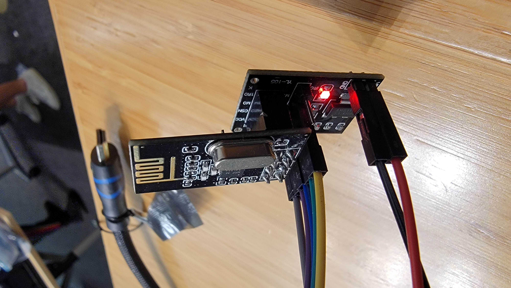
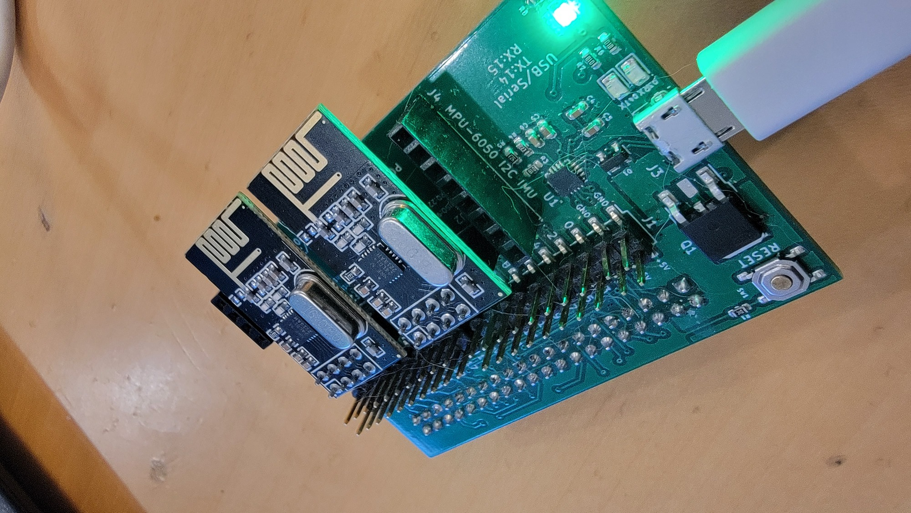
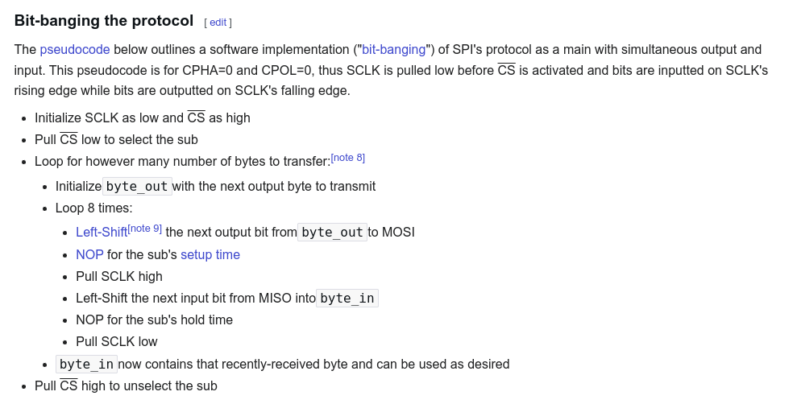
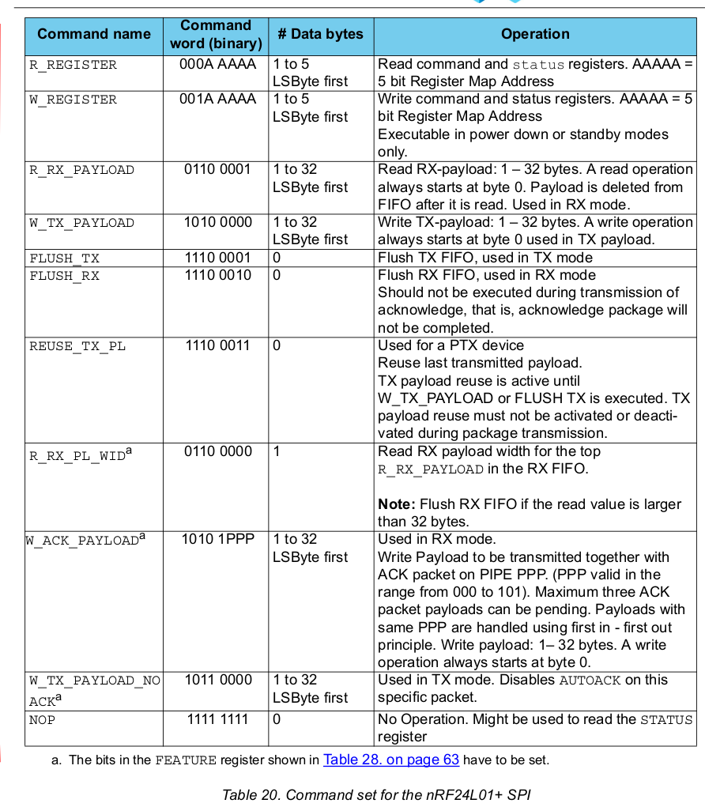
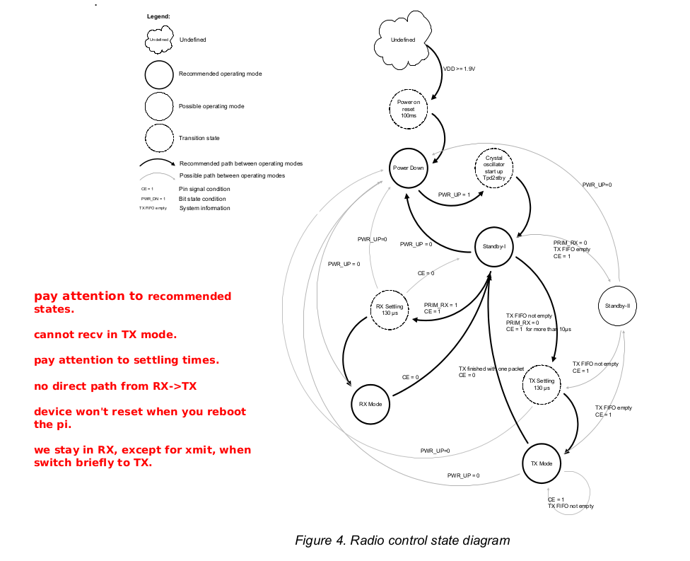
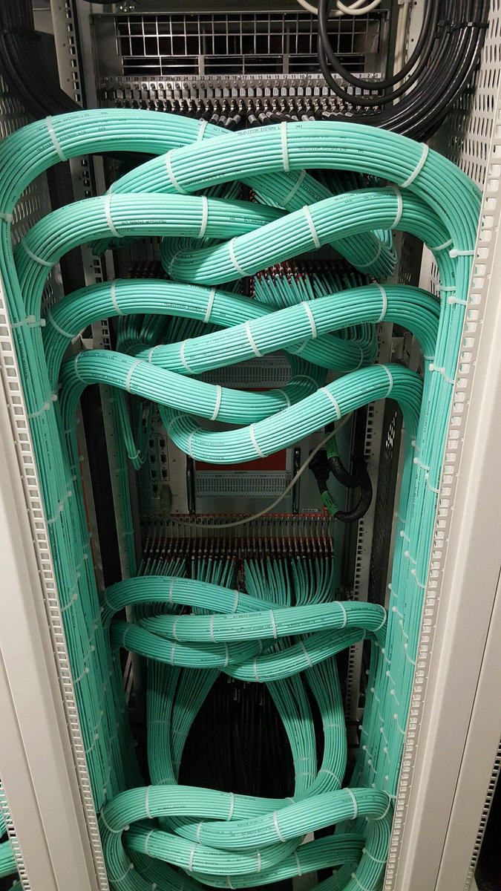

## Get two nrf24l01p RF transceivers to talk to each other.

<p align="center">
  
</p>


-----------------------------------------------------------------
### Errata

  - Going from "Power Down" to "RX": table 16 on page 24: a safe
    value seems to be 5ms.  I'm not sure how we calculated 2ms
    (which does *appear* to work).

  - `nrf_init`: so the test pass always set `NRF_RX_ADDR_P0` to 0.
    This is a bit weird, but that's the way the tests are (sorry).

  - make sure you increment the stats fields.  

    When you send a packet:

            n->tot_sent_msgs++;
            n->tot_sent_bytes += nbytes;

    On tx if a packet gets lost:

            n->tot_lost++;

    When you receive a packet:

            n->tot_recv_msgs++;
            n->tot_recv_bytes += nbytes;


-----------------------------------------------------------------
#### tl;dr: hints and mistakes

We put these here so you can easily scroll.  Will add errata
as needed.


HINTS:
  - If you have issues, the first thing to do is
    switch to using the `staff_nrf_init` routine.
  - Make sure you look at the first few test cases, since they
    have a lot of comments about where stuff is.

Key pages:
  - p 57-63: The full set of NRF registers.
  - p 75: transmit protocol.
  - p 76: receive protocol.
  - p22: state machine: make sure you know what states to move to and
    how to do it.  we care about RX, TX, standby-I.  stay in the
    "recommended" states.
  - Make sure you go through the [CHEATSHEET](./CHEATSHEET-nrf24l01p.md).
    A bunch of facts you need are there, so it's a good cheat-code.

Common mistakes:

  - Getting a max-intr message consistently: this can happen if
    your send and receive pipes don't match up (different byte
    or ack settings).

  - NRF addresses are more than one byte!  Make sure you
    use the `nrf_get_addr` and `nrf_set_addr` methods (`nrf-hw-support.c`)
    which (1) do sanity checking and (2) use the right SPI calls to set
    and get multiple-bytes.  For example:
```
    nrf_set_addr(n, NRF_TX_ADDR, 0, addr_nbytes);
    nrf_set_addr(n, NRF_RX_ADDR_P1, rxaddr1, addr_nbytes);
    nrf_set_addr(n, NRF_RX_ADDR_P0, rxaddr0, addr_nbytes);
```
  - Hard to debug error: Hard-coding a value in `nrf_init`.
    Works fine on an initial test, then doesn't work at all
    when client code uses a different value (e.g., for rx or tx 
    addresses).  This mistake caused some groups last year to 
    waste over an hour.

  - If you've finished init (and your dump matches the staff), but 
    you can't tx/rx/ack anything, make sure you're setting the 
    CE pin correctly (it's a GPIO pin, so you have to control it 
    manually)


NOTE: The code is currently setup so that all the tests *should* pass
if you just run `make check`.

   - ***NOTE: with 70+ people in one room we may have significant
     RF interference***
   - So: if the tests don't pass, this doesn't mean the code is broken.
     It may just mean you are getting interference.

     If you look in `nrf-default-values.h` there are different addresses
     you can try (you can use others too).  You can change `server_addr`
     and `client_addr` (the tests use these for configuration).
     Worth plugging them in to see if reduces issues.

     You can also use a different channel by changing
     `nrf_default_channel`.

     NOTE: if you change these values, the tests won't pass as-is since
     the addresses are encoded in them.  Make sure "make run" works fine,
     make a backup copy of the tests and you can then regenerate the
     tests with "make emit".


-----------------------------------------------------------------

#### Description

Today you'll build some code to make the NRF chips we have talk to
each other.   
The NRF's are very common, and fairly cheap (we are using clones that
were about $14 per 12).
The lab is organized as a fetch-quest where you'll build
the routines to (1) initialize, (2) receive, (3) send non-acked packets,
(4) send acked packets.  This gives you a simple starting point for
networking.    

The NRFs are extremely common and fairly cheap --- ours were 
12 boards for $14 (though, likely fake clones).

<p align="center">
  
  
</p>

Parthiv's board makes this much easier than in the past.  On the other
hand the size of the datasheet makes it not that easy.  As a result,
we have way more starter code than usual.
If you are doing this *without* Parthiv's board and need to wire things
up with jumpers, the 2022 NRF lab has some discussion 
on [how to do this](https://github.com/dddrrreee/cs140e-22win/tree/main/labs/17-nrf24l01p).

Before you start:
  - Plug in the NRF boards.
  - The code is currently setup so that all the tests *should* pass
    if you just run `make check`.
  - If it fails, look at why. 

    If the configuration failed (e.g., the "0" tests): the problem
    could be that you plugged the boards in wrong (see the photo).
    Or you could have a defective NRF or Parthiv board --- you'll have
    to swap things out to narrow down.

    If you get a smattering of packet losses, this is likely just
    interference. Try rerunning the tests.  If it gets too bad, we'll
    need to change addresses --- if you do look at the above note on
    how to redo the tests.

#### The code

Common methods you'll use:
  - `nrf_dump` (`nrf-hw-support.c`) will dump the current NRF 
    configuration.  Good to do whenever things go awry.
  - `nrf_get8`, `nrf_getn`: get a single byte, get N bytes from
    NRF using spi.
  - `nrf_put8`, `nrf_put8_chk`, and `nrf_putn`: write a single
    byte, write and check a single byte, write N bytes using
    SPI.
  - `nrf_assert` and `nrf_opt_assert` (`nrf.h`): macros to check
    a boolean.  If check fails will dump the NRF configuration and panic.
    `nrf_opt_assert` can be easily disabled by setting a flag for
    speed tests.

What you will change:
  - `nrf-driver.c`: all the code you write will be in here.

  - `nrf-default-values.h`: different default values for the NRF.  You 
    can change these if you want to tweak different decisions, but
    you don't have to.

Key files that you should not have to change:
 - `tests/*.c`: tests.  Look through these to see how to use the 
   NRF interfaces.
 - `nrf.h`: defines the `nrf_t` the NIC structure and `nrf_config_t`
   which holds some of the configuration.  
 - `nrf-hw-support.h`: many accessors for reading and writing
   NRF registers and SPI interface. You really want to look at this 
   to save time.
 - `nrf-hw-support.c`: SPI read/write routine implementation, routines
   to dump the NRF configuration.
 - `nrf-default-values.h`: default values for NRF hardware choices.
   You want to look at to see what we can change and for where
   to get the requested values.
 - `nrf-public.c` simple veneer over the top of NRF interface to make
   sending and receiving packets easier.
 - `nrf-test.h`: helpers for testing.  Useful to look at to see how
   to use the NRF interfaces.

#### Check-off

Pretty simple:
  1.  You should have implemented your own copies of the `staff_` routines
      and removed `staff-nrf-driver.o` from the makefile.
  2. `make check` should pass.
  3. Adapt a test case to ping pong with your partner.   Make sure
     you setup the right addresses!  Your transmit address should 
     be your partner's receive address and vice versa.  Also,
     the configuration of the pipe should match: whether it's acked,
     and the number of bytes.

Major extension:
  - You can always do this lab on hard mode and build your own from
    scratch: you'll learn a lot.  The tests give reasonable interfaces.
    Doing this plus a network boot-loader would be a reasonable final
    project.

--------------------------------------------------------------------------------

### Some incomplete big picture information.


#### SPI

The NRF uses SPI to communicate.  This is a reasonably simple digital
protocol, that you can bit bang without much fuss.  One big downside
of SPI is that it needs many wires.  And when you multiply these by the
number of ends (2) and number of NRFs (2) there's a high probability
one is loose.  (Fortunately Parthiv's board has solved that for us:
we can just plug them in!)


The r/pi has hardware support for SPI.  We give you this driver,
but you can write it driver as an extension.  Or you just bit bang
using [the Wikipedia code](https://en.wikipedia.org/wiki/Serial_Peripheral_Interface):

<kdb>  </kdb>

If you bit-bang, the r/pi hardware GPIO mapping is:
```
    enum {
        mosi        = 10,
        miso        = 9,
        clk         = 11,
        chip_0_ce   = 8,
        chip_1_ce   = 7,
    };
```
And the initialization would be:
```
    gpio_set_output(mosi);
    gpio_set_input(miso);
    gpio_set_output(clk);
    gpio_set_output(ce);
    // either chip_0_ce or chip_1_ce
    gpio_write(ce,1);
```

##### How-to NRF input and output with SPI

Each NRF "register" is 8-bits;
we give these in `nrf-hw-support.h`:

```
// register numbers.  p57
enum {
    NRF_CONFIG      = 0x0,
    NRF_EN_AA       = 0x1,
    NRF_EN_RXADDR   = 0x2,
    NRF_SETUP_AW    = 0x3,
    NRF_SETUP_RETR  = 0x4,
    NRF_RF_CH       = 0x5,
    ...
```

To get and set NRF registers you specify the register you want (from
above), and use the SPI routines to read and write.  SPI is a bit weird
in that it takes produces as many bytes as output as it took as input.
So you'll notice the transmit and receive buffers for each operation
take the same size input.

Reading a single NRF register using SPI:
```
// nrf-hw-support.c
uint8_t nrf_get8(const nrf_t *n, uint8_t reg) {
    uint8_t rx[3], tx[3];
    tx[0] = reg;    
    tx[1] = NRF_NOP;  // state NRF should ignore.
    
    spi_n_transfer(n->spi, rx,tx,2);
    return rx[1];
}   
```

Writing a register requires or'ing in the bit-pattern for writes
so the receiver can tell the difference from a read:
```
// nrf-hw-support.c
uint8_t nrf_put8(nrf_t *n, uint8_t reg, uint8_t v) {
    uint8_t rx[3], tx[3];
    
    // see p51
    tx[0] = NRF_WR_REG | reg;
    tx[1] = v;
    spi_n_transfer(n->spi, rx,tx,2);

    return rx[0];   // status.
}
```
For other commands, see: `nrf_tx_flush` and
`nrf_rx_flush` routines (`nrf-hw-support.c`)

Generally, when first bringing up a device, we read back any configuration
values we write as an easy automatic way to validate that (1) we
understood the datasheet and (2) all the code and hardware is working.
The routine `nrf_put8_chk` does this automatically.

#### NRF SPI commands (p 51) 



#### The key state machine

Make sure you look at this carefully!



--------------------------------------------------------------------------------
### Part 0: Implement `nrf-driver.c:nrf_init`.

#### tl;dr

What to do:
  1. Look at `tests/0-ack-check.c` and `tests/0-no-ack-check.c`
  2. Implement `nrf_init`.
  3. `make check` for the `tests/0-ack-check.c` and `tests/0-no-ack-check.c`
     should pass.  Then make sure *all* the tests pass.
  4. NOTE: if there is enough interference (or just bad luck)
     packets can get lost and the later tests (1-3) can fail.  In this
     case  you can re-try or just run the test and make sure it does
     send and receive some packets (versus 0) before panic'ing.  You
     can also try changing addresses (see start of `README`).

#### longer description

This is the longest part, since you need to set all the registers.

Cheat code:
   - If you get stuck you can use `nrf_dump` to print the staff
     hardware configuration and then walk down the registers setting
     them to the same thing.

   - COMMON MISTAKE: sure you set the values ***based on the inputs***.
     A common mistake is to hard-code values (e.g., receive and transmit
     addresses), which won't work when you write code that uses different
     ones.  (Such as the last tests.)

   - NOTE: It should be the case that if you change default values that
     both still agree!

As mentioned above, for simplicity, you'll only configure the NRF to use
a single pipe.  This pipe can either be initialized for acknowledgements
(`ack_p=1`) and or no acknowledgements (`ack_p=0`) but not both.

   -  `ack_p=0`: for this you only have to enable pipe 1.
      No other pipe should be enabled.  

   - `ack_p=1`: as the NRF data sheet states, for ack'd pipes
     you need both pipe 1 enabled as well as pipe 0 
     (for the ack replies).

     This config is used by a test `1-one-way-ack.c` which sends a 4
     byte value back and forth between the client and the server.

   - After you implement these and delete the call to
     `staff_nrf_init` all the tests should still pass.


#### Key points: read this before coding.

Some advice (which should duplicate the comments in `nrf_init`).
Before you start reading and writing the NRF you need to setup the 
structure:

```
  nrf_t * nrf_init(nrf_conf_t c, 
                    uint32_t rxaddr, 
                    unsigned acked_p) 
  {
        nrf_t *n = kmalloc(sizeof *n);
        n->config = c;          // save config
        nrf_stat_start(n);      // initialize stats.

        // nrf-hw-support.c: initialize SPI+GPIO
        n->spi = nrf_spi_init(c.ce_pin, c.spi_chip);

        n->rxaddr = rxaddr;
        // initialize the data queue 
        cq_init(&n->recvq, 1);

        // p22: put in power-down before configuring
        nrf_put8_chk(n, NRF_CONFIG, 0);
        assert(!nrf_is_pwrup(n));

        // disable all pipes.
        nrf_put8_chk(n, NRF_EN_RXADDR, 0);
```

Discussion:

  1. We use `nrf_spi_init` (in `nrf-hw-support.c`)
     to setup GPIO and SPI first or we can't talk to the NRF chips and
     nothing will work.  For our tests, the configuration values
     used for SPI and the GPIO CE pin are set in `nrf-test.h` in 
     either `parthiv_left` or `parthiv_right`.
  2. p22: You must put the chip in "power down" mode before you change
     the configure.
  3. If in not-ack mode,  just enable pipe 1.
  4. If in ack mode,  you have to enable both pipe 0 and pipe 1.
     Pipe 0 is needed to receive acks.  

  5. NOTE: when we reboot the pi, the NRF chips are still on --- they
     don't know to reset.   So it's crucial to set every NRF register 
     you depend on.  Don't assume it has its default value.
  6. Related to point (5), but also just good hygiene:
     After configuration, you should flush the RX (`nrf_rx_flush()`)
     and TX FIFOs (`nrf_tx_flush()`) before putting the chip in "power
     up" mode since its possible they hold garbage.  

     Recall: This is similar to what we did for UART.

     For today they should also be empty:

            // see <nrf-hw-support.h>
            assert(!nrf_tx_fifo_full(n));
            assert(nrf_tx_fifo_empty(n));
            assert(!nrf_rx_fifo_full(n));
            assert(nrf_rx_fifo_empty(n));
        
            assert(!nrf_has_rx_intr(n));
            assert(!nrf_has_tx_intr(n));
            assert(pipeid_empty(nrf_rx_get_pipeid(n)));
            assert(!nrf_rx_has_packet(n));

  7.  We don't use dynamic payload or feature stuff today:

            // dynamic payload
            nrf_put8_chk(n, NRF_DYNPD, 0);
            // feature register.
            nrf_put8_chk(n, NRF_FEATURE, 0);

  8. After all registers are configured:

     1. Put the device in "power up" by writing 1 to the `NRF_CONFIG`.
     2. Then, as is common for complex devices: Wait "long enough" for the
        device to set itself up.  In this case, delay 2 milliseconds
        (`delay_ms(2)`). 
     3. Put the NRF in "RX mode".  The enum `rx_config` has the
        bits set the way we need them.  NOTE: don't ignore the CE pin
        (`n->config.ce_pin`).  Look at the state diagram to see how to 
        get to a legal transition state.

  9. In general add tons of asserts to verify that things are in the
     state you expect.

### Easily catching some common mistakes

As discussed in the initial README notes, when setting configuration
registers, use `nrf_put8_chk` (provided in `nrf-hw-support.c`):

        nrf_put8_chk(n, NRF_RX_PW_P1, c.nbytes);

That will automatically read back the value after writing it and
`panic` if it differs.  You should use it for almost all standard
registers (note the `NRF_STATUS` will act differently: why?)

In general, when implementing device code for an unknown device: if
you write a value to a register that you believe should not change,
read the value back and check it.  This will detect:
  1. If the register discards values in ways you didn't expect.  
  2. If the register uses a different size than expected or you
     misunderstood the helper routines (this happened when people set
     the multi-byte address using `put8` routines which just write a
     single byte).
  3. Broken hardware: if one of your NRF devices (or Parthiv board slots)
     is dead.
  4. Device mis-configuration, e.g., the SPI clock was too fast so the 
     device couldn't keep up.


#### Common bugs

Two quick bugs:
   - If you've finished `nrf_init` (and your dump matches the staff), but
     you can't tx/rx/ack anything, make sure you're setting the CE pin
     correctly (it's a GPIO pin, so you have to control it manually)

   - As mentioned above, the receive and transmit addresses are
     multi-byte.  They can't be written with a simple `nrf_put8` (which
     just writes 1 byte).  You can use `nrf_set_addr` to set the address:

            nrf_set_addr(n, NRF_RX_ADDR_P1, rxaddr, addr_nbytes);

     You should use it and look at its implementation to see
     how it works.  (For any new SPI device you'd likely have to 
     figure out something similar!)

The most common bug from class: Not correctly putting the NRF into 
RX mode:

  - The result: the NRF values in the 0 tests would match, but 
    the NRF would not receive messages in the later tests.

  - This issue extended later to messing up the general
    transition between RX mode and TX mode.

  - If you look at the state machine on page 20, you can see that we
    can move between RX mode and TX mode in the same way: (1) write
    CE=0 (to get to `Standby-I` state) (2) set `NRF_CONFIG` to either
    `rx_config` or `tx_config` as appropriate, and finally (3) set CE=1.

    Thus, RX mode: `CE=1` and `NRF_CONFIG=rx_config`.
    TX mode: `CE=1` and `NRF_CONFIG=tx_config`.

  - Your code will go back and forth between RX mode and TX modes
    in multiple places. After all the debugging in the lab, I strongly
    suggest you write two routines (e.g., `nrf_tx_mode` and `nrf_rx_mode`)
    so you can write this code once, get it right, and then forget
    about it.

  - Recall from the cheatsheet: when the NRF is not in RX mode it will
    blithely ignore all packets sent to it.  Thus, we are always in RX
    mode other than a brief flip to TX to send a packet.  

  - In summary from above: at the end of `nrf_init`, we should be
    in RX mode and thus from these previous values: with `CE=1` and
    `NRF_CONFIG=rx_config`.)


Second most common bug: in `nrf_init` hard-coding variables as constants.

  - This is partly on me: a nasty bug people hit was caused by
    hard-coding NRF initialization values rather than setting 
    them based on input.  

    Common result: the `0` tests and 4-byte message tests passed, but
    the 32-byte message tests would fail (since the NRF was hard-coded
    for 4-bytes).  Similarly, hard-coding the NRF receive address which
    meant it wouldn't receive anything if the address changed.

  - You should be setting the NRF's receive address using `rxaddr` and
    its message message size using the `nbytes` in the `config` structure.

    In general, all the values in the `nrf-default-values.h` should be 
    used during setup.  Don't hard-code.


--------------------------------------------------------------------------------
### Part 1: Implement `nrf-driver.c:nrf_tx_send_noack`.

<p align="center">
  
</p>

#### tl;dr:

What to do:
  1. Look at `tests/1-one-way-no-ack-4bytes.c`.
  2. Implement `nrf_tx_send_noack`.
  3. `make check` for the `tests/1-one-way-no-ack-4bytes.c` should pass.
  4. NOTE: again, if there is enough interference (or just bad luck) 
     packets can get lost and `make check` won't pass.

#### Longer description

You'll implement sending without acknowledgements.  For a rough reference
(for ack'd packets), look at Appendix A (page 75): "Enhanced ShockBurst
transmitting payload".

Roughly:
  0. Before going into TX mode, loop and process packets (`nrf_get_pkts`).

  1. Set the TX address:

            nrf_set_addr(n, NRF_TX_ADDR, txaddr, addr_nbytes);

  2. Write the message to the device using `nrf_putn` with the NRF
     command `NRF_W_TX_PAYLOAD`:

            nrf_putn(n, NRF_W_TX_PAYLOAD, msg, nbytes);

     At this point "the TX fifo is not empty" as per the state machine.

  3. We are currently in RX mode.  So to transmit the packet we go
     to TX mode using the state machine on p22.

     AFAIK, going from "RX" to "Standby-I" to "Standy-II" with data is
     the the fastest way to go from "RX" to "TX" as follows (but: always
     trust p22 over us):

      1. Put the packet in the TX FIFO.
      2. From RX: Go to Standby-I by setting `CE=0` (see state machine).
         I think step 1 and step 2 can be interchanged.  
      3. Set `NRF_CONFIG=tx_config`;
      4. Set `CE=1`.  The state machine says "for at least 10usec",
         but see step 5.
      5. We will then wait for the TX to finish (below) ---
         because transmit will then be done, I do not believe we need
         to explicitly wait for 130usec (the transition state) nor the
         10usec in step 4.

     NOTE: you should `assert` using the helpers `nrf_is_tx` and
     `nrf_is_rx` to make sure you're in the expected states.

  4. Detect when the transmission is complete by either (1) waiting
     until the TX fifo is empty or (2) for the TX interrupt to be
     triggered.  I *believe* the methods are equivalent.  The latter
     (interrupts) is similar to sending with acks so probably makes
     more sense.

  5. Clear the TX interrupt and increment the stats fields.

            n->tot_sent_msgs++;
            n->tot_sent_bytes += nbytes;

  6. Transition back to RX mode.
  7. Return the number of bytes sent (just `nbytes` that the routine
     was called with).
  8. When you get rid of the call to our `staff_nrf_tx_send_noack` the
     tests should work.

--------------------------------------------------------------------------------
### Part 2: Implement `nrf-driver.c:nrf_get_pkts`.

The basic idea: pull packets off the RX fifo until there are none, and
push the data into single NRF receive queue `recvq`, and return the count.
For a reference, see the receive steps on Page 76, Appendix A, "Enhanced
ShockBurst receive payload".

Roughly:
  1. While the RX fifo is not empty (`!nrf_rx_fifo_empty(n)`)
     loop pulling packets.

  2. Get the pipeid for the incoming packet using the 
     status field (page 59) or the helper `nrf_rx_get_pipeid(n)`.
     Today, it should always be for
     pipe 1.  You should panic if not.

  3. Read in the packet using `nrf_getn`:

            status = nrf_getn(n, NRF_R_RX_PAYLOAD, buf, n->config.nbytes);

     Use the status to check that its for the right pipe and then
     push it onto the `recvq`:   

            if(!cq_push_n(&n->recvq, msg, nbytes))
                panic("not enough space in receive queue\n");

  4. Clear the RX interrupt.
  5. Increment the count of packets read.
  6. When done: return the number of packets read.
  7. When you remove the call to our `staff_nrf_get_pkts` the 
     tests should still work.

#### Most common bug

The most common mistake I saw was reading incoming messages (step 3)
into a too-small temporary buffer message.  Packets can be up-to 32
bytes, so the size of the temporary buffer you read packets into (`buf`)
should be 32-bytes.  Multiple people read the packets into a `uint32_t`
temporary, which would work great for 4-byte packets (same size) but
corrupt the stack in weird ways if larger.  If you have weird corruption
issues, it is probably from this mistake.

--------------------------------------------------------------------------------
### Part 4: Implement `nrf-driver.c:nrf_tx_send_ack`.

<p align="center">
  
</p>

#### tl;dr:

What to do:
  1. Look at the 2 and 3 tests.
  2. Implement `nrf_tx_send_ack`.
  3. `make check` for the 2 and 3 tests should pass.
  4. NOTE: as before, you can get interference, but retry should work. 

#### Longer descrption

You'll implement sending with acknowledgements.  It will look similar to 
the no-ack version, except:

 1. You need to set the P0 pipe to the same address you are sending 
    to (for acks).

        nrf_set_addr(n, NRF_RX_ADDR_P0, txaddr, addr_nbytes);

 2. You need to check success using the TX interrupt (and clear it).

 3. You need to check for the max retransmission interrupt
    (there is a helper `nrf_has_max_rt_intr(n)`),
    which the hardware sets when it has not received an ACK 
    after re-sendig the packet the maximum number of times configured
    by `nrf_init`.

    For today, just panic if this occurs (it should not except in the
    case of extreme interference).  For an extension below, you could
    then do a randomized exponential backoff and retry.

 4. When you are done, don't forget to set the device back in RX mode.
 5. Return the numbe of bytes sent (just `nbytes` that the routine
    was called with).

When you get rid of the call to our `staff_nrf_tx_send_ack` the tests
should work.  If the ack-tests break, make sure you've enabled pipe 0
since the hardware uses that to receive acknowledgements.

--------------------------------------------------------------------------------
### Part 5: write a test to send to your partner.

***NOTE***:
  - make sure you set the server and client address correctly!  (In
    you code your partner should be the client, and you should be server.
    In your partner's code, you should be the client and they should
    be the server.)
  - if it doesn't work (or you get "max-intr" errors its likely you
    misconfigured the addresses or the pipes (nbytes, ack or no ack).

Write a test that will ping pong packets between your pi and your partner.
Their RX address should be the TX address you send to and vice-versa.
If you the ping-pong test note it flips addresses internally, so you'll
have to change this.

If you have problems:
  1. As a first step, make a one-way test where one pi sends packets in
     a loop (e.g., every second) and the second pi waits for them and 
     prints when it receives.  Ping pong requires that RX and TX are
     working on both pi's (including address assignment) whereas 
     a one-way test only requires TX working on one and RX on the other.

  2. Insert a `nrf_dump` right before sending or receiving and make sure
     everything matches (e.g., the channel, etc).  

Congratulations!  You now have simple working networking system.  

<p align="center">
  
</p>

--------------------------------------------------------------------------------
### Extensions

There's a ton of extensions.  Building out most of these would 
be a great, useful final project:
  1. Speed!  The code is slow.  You should be able to tune it.
     One easy change is to change it so it can send multiple
     packets at a time.   Assuming you can get close to hardware
     speeds this is a legit final project.
  2. Make a reliable FIFO.
  3. Do a network bootloader.
  4. Do exponential backoff to handle the case where two nodes blast
     each other .
  5. Do a tiny little distributed system!
  6. Replace our SPI with a bit-banged version (this is about 15 lines,
     you can take right from the wiki-page for SPI).
  7.  Use more pipes.
  8. Send and receive using both NRFs to double the effective bandwidth.
     A great final project is seeing how many NRFs you can drive at once.
  9. Cool final project: hook up 10+ NRFs (maybe using a custom pcb) and
     see how many you can drive at once.   

     Related: have multiple  NRFs (e.g., two :) and provide a virtual
     interface that makes it easy to send multiple packets at once.

#### Use interrupts

A very illuminating modification is to change the code to 
use interrupts!  This will allow you to make it much faster.

  1. Connect the NRF interrupt pin to a free GPIO pin.
  2. Grab the code from the GPIO interrupt lab.  and steal the initialization and 
     interrupt handler code.
  3. Should hopefully just take 20 minutes or so.
 
#### Implement your own software SPI

I just used the SPI code in the wikipedia page; worked first try.
If you do this make sure:
  - You set the SPI pins to input or output correctly.
  - Use the same pins that hardware SPI will use. 
  - That you are setting the chip select pin high and low as needed.
  - That you aren't sending data too quickly (the NRF's are actually
    pretty slow).  I would start slow and speed up until it breaks.

#### Remote put32/get32

Do a remote put32/get32:
  1. You can write a small piece of code that waits for PUT32 and GET32 messages and
     performs them locally.
  2. This lets remote pi's control it.
  3. Should be pretty easy to make a small shim library that can run your old programs
     remotely.

---------------------------------------------------------------------------
<p align="center">
  
</p>
