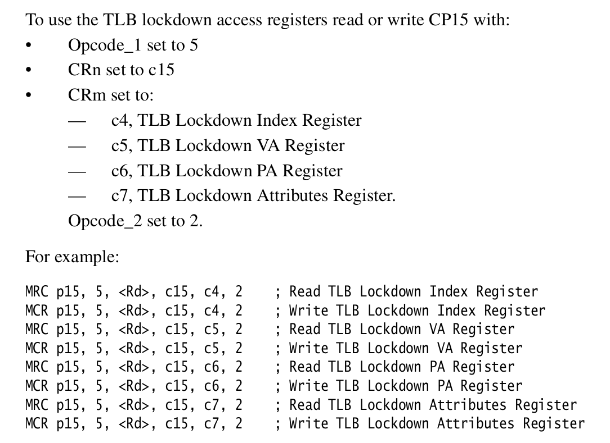
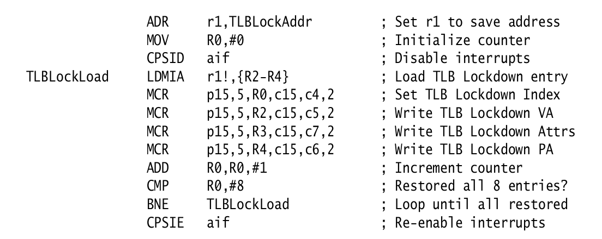
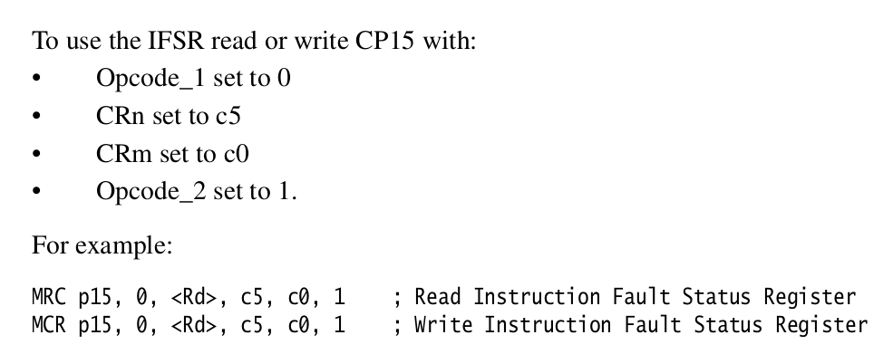
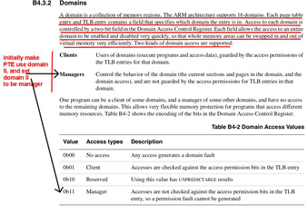

## Simple virtual memory using pinned TLB entries.

<p align="center">
  
</p>

### Clarifications and Errata

BUG:
  - Part 3: This step is a bit annoying.  The initial `staff-pinned-vm.o`
    exports the name `lockdown_print_entries`, so you wouldn't be
    able to write yours and still use staff routines.

    So do a git pull, and drop the following code at the end of your
    `pinned-vm.c` and do a `make clean` and `make check` to make
    sure things still work.

```
void staff_lockdown_print_entry(unsigned idx);

void lockdown_print_entry(unsigned idx) {

    staff_lockdown_print_entry(idx);
}

void lockdown_print_entries(const char *msg) {
    trace("-----  <%s> ----- \n", msg);
    trace("  pinned TLB lockdown entries:\n");
    for(int i = 0; i < 8; i++)
        lockdown_print_entry(i);
    trace("----- ---------------------------------- \n");
}
```

    

  - Part 2: change the following calls in the tests to delete
    the `staff_pin_`.  So from:

        1-test-two-addr.c: staff_pin_mmu_init(dom_bits);

    To:

        1-test-two-addr.c: pin_mmu_init(dom_bits);

    Note: ignore the  `1-test-setup.c` test.  We don't use it.

  - Part 2: You have to implement both `pinned-vm.c:pin_mmu_init` and
    `pin_set_context` at the same time.

  - You are only implementing the pinned routines.  For today,
    you should call any needed `staff_mmu_*` routines (just 
    like the tests do) rather than re-implementing them.  You
    will write the `mmu_*` routines next week.
  - We added some clarification for `pin_clear` and `tlb_contains_va`.
    in Part 2.

Hints:
  - We don't use secure mode.  So just set that stuff to 0.

  - One way to make things much easier is to run with our code
    and call `lockdown_print_entries` to see the exact content of the TLB.
    Makes it easy to check what bits should be (e.g., for secure mode,
    not secure).  Even easier is that you could also look directly in
    the .out files since they often have printed the TLB.

    Of course, if you want Daniel mode do without :).  

  - NOTE: if you do call `lockdown_print_entries` it modifies
    the lockdown index register so you can't rely on its value
    afterwards.  In particular you probably don't want to call
    it when doing `pin_mmu_sec`.

------------------------------------------------------------------------------
### Overview


tl;dr: the goal:
  1. Get rid of `staff-pinned-vm.o` in the `Makefile`.  
  2. `make check` should pass for all the tests.  You'll have
     to modify some of the calls to staff routines (the ones 
     that were in `staff-pinned-vm.o`).
  3. You will also have to write some exception handling code to 
     disambiguate the cause of exceptions (see part 4).
  4. I would do the tests in order.  The first one `1-test-basic-tutorial.c`
     has tons of comments.

Given that it's midterm week we'll do a fairly simple virtual memory
(VM) lab that side-steps a major source of VM complexity --- the need
to use a page table --- by instead "pinning" the translations we need
in the TLB.  This dramatically simplifies what you have to understand
and makes it possible to write a working VM system in a few hundred
lines of code.  

Make sure you've read:
  - [PRELAB.md](PRELAB.md)!
  - [VM-CHEATSHEET.md](VM-CHEATSHEET.md) has a bunch of useful page numbers.


For today:
  1. You'll get a single address space working that just prints
     a "hello world" with virtual memory enabled using an identity
     mapped address space.

  2. You'll then write code to handle the main exceptions that can
     come up: writing to unmapped memory, accessing mapped memory
     without correct permissions, and handling domain faults.

  3. There are a bunch of extensions you can do, including a few of
     the more interesting 240lx labs.

While the code isn't that complex --- mainly about 10 privileged
instructions drawn from a few pages of chapter 13 of the arm1176 manual
--- the system works.   You can easily start building it out into a
more functional setup.  As it stands it gives an easy way to add memory
protection to an embedded system even if it doesn't use user processes.

Next week will do two more 
advanced VM labs:
   1. Next Thursday: writing the assembly code needed to switch address
      spaces, handle mapping modifications, etc. (This is some of the
      most tricky code that exists: we xeroxed the relavant chunk of
      the manual, please read it several times!)

      This lab will involve using the equivalance code you have to check
      that the end-to-end system works correctly.

   2. Then: using full page tables and speeding things up.  

Today's lab should give you more of a feel for whats involved and
prep your mind for the substantial reading needed.   I'd set aside
a big chunk of time this weekend to go over the readings carefully.
They are complicated.  That is just the way it is.

As complicated as these documents are, you'll need to read them carefully,
and write the code *extremely* carefully.  The expected value of a
VM mistake = "worst bug you've hit this quarter".    A handful of the
reasons:

  - Errors will almost certainly be sporadic.  In fact, many errors
    will work just fine on a simple test and only show up in a busy,
    loaded system (e.g., a bug that causes just the right-wrong reuse
    of ASIDs or memory pages works great on a lightly loaded system
    that has no reuse).
  - Virtual memory bugs typically cause a virtual address to resolve to
    the wrong physical address, thereby causing the stores in *correct*
    code to explode into memory corrupting shotgun blasts.  It's even
    more exciting when code pages are mapped incorrectly!
  - These bugs often slyly have you focus on the wrong place --- a
    corruption will cause a random piece of code to get the wrong value
    or write to the wrong location, you'll spend time trying to debug
    the code that performed the errant memory operation, when in fact
    distal cause of the error in an entirely different location where
    you didn't (for example) clear a cache.

    As the cliche goes, it's the punch that you don't see that knocks
    you out, and many of VM bugs come from places you aren't looking at.

In these next labs we'll aggressively use the single stepping equivalance
code you wrote last lab to check for VM errors.  For example, at each
single step fault: turning the VM off and on, randomly swapping the page
mappings, causing ASIDs to be resused, etc.

(We should have done equivalance checking this lab, but unfortunately,
the interfaces between the two are still in flux so I didn't want to
rathole down a dead-end that you'd have to redo.  With that said: it's
a good thing to add to last lab if you want an interesting project.)

Since there's a lot going on today, the lab `README.md` has been stripped
down to mostly mechanical instructions so you have more time to look at
the code.

Since there are a bunch of data structures (in this case for the machine
state) there's a bunch of data structure code.   The rough breakdown:

   - `staff-*.o`: these are the object files we give you to get you
     started. You can view today's and tues's labs as fetchquests for
     how-do-I-do-X where the goal is to implement everything yourself
     and delete our implementations.

  - `pinned-vm.h` and `mmu.h`: this has the data structures we will use today.   I've tried
    to comment and give some page numbers, but buyer beware.

  - `arm-coprocessor-asm.h`: has a fair number of instructions used to
    access the privileged state (typically using "co-processor 15").
    Sometimes the arm docs do not match the syntax expected by the GNU
    assembler.  You can usually figure out how to do the instruction
    by looking in this file for a related one so you can see how the
    operands are ordered.

   - Recall: if the page numbers begin
     with a `b` they are from the armv6 general documents (the pdf's that
     begin with `armv6` such as `armv6.b2-memory.annot.pdf`) Without a
     letter prefix they come from the `arm1176*` pdf's.

#### Check-off

You need to show that:
  1. You aren't linking against `staff-pinned-vm.o`.
  2. You can handle protection and unallowed access faults.

------------------------------------------------------------------------------
#### Virtual memory crash course.

You can perhaps skip this, but to repeat the pre-lab:

 - For today's lab, we will just map 1MB regions at a time.  ARM calls
 these "segments".

 - The page table implements a partial function that maps 
   some number of 1MB virtual segment to an identical number of
   1MB physical segments.    

 - Each page table entry will map a single segment or be marked as
   invalid.

 - For speed some number of entries will be cached in the TLB.  Because
   the hardware will look in the page table when a TLB miss occurs, the
   page table format cannot be changed, and is defined by the architecture
   manual (otherwise the hardware will not know what the bits mean).

 - What is the page-table function's domain?  The r/pi has a 32-bit
   address space, which is 4 billion bytes, 4 billion divided by one
   million is 4096.  Thus, the page table needs to map at most 4096
   virtual segments, starting at zero and counting up to 4096.  Thus the
   function's domain are the integers ``[0..4096)`.

 - What is the page-table funtion's range?  Not including GPIO,
   The r/pi has 512MB of memory, so 512 physical segments.  Thus the
   maximum range are the numbers `[0..512)`.

 - While there are many many details in virtual memory, you can
   mitigate any panic by always keeping in mind our extremely simple goal:
   we need to make a trivial integer function that will map `[0...4096)
   ==> [0..512)`.  (GPIO also adds some numbers to the range, but you
   get the idea.)  You built fancier functions in your intro programming
   class.  (In fact, such a function is so simple I'd bet that it wouldn't
   even rise to a programming assignment.)

The only tricky thing here is that we need ours to be very fast.
This mapping (address translation) happens on every instruction,
twice if the instruction is a load or store.  So as you expect we'll
have one or more caches to keep translations (confusingly called
"translation lookaside buffers").  And, as you can figure out on your
own, if we change the function mapping, these caches have to be updated.
Keeping the contents of a table coherent with a translation cache is alot
of work, so machines generally (always?) punt on this, and it is up to the
implementor to flush any needed cache entries when the mapping changes.
(This flush must either only finish when everything is flushed, or the
implementor must insert a barrier to wait).

Finally, as a detail, we have to tell the hardware where to find the
translations for each different address space.  Typically there is a
register you store a pointer to the table (or tables) in.

The above is pretty much all we will do:
  1. For each virtual address we want to map to a physical address, insert
  the mapping into the table.
  2. Each time we change a mapping, invalidate any cache affected.
  3. Before turning on the MMU, make sure we tell the hardware where to 
     find its translations.

----------------------------------------------------------------------
## Part 1: implement `pin_mmu_sec`

What to do today:
  - Read the pages: 3-149--- 3-152 and 3-79 --- 3-82.
  - Assume 1MB sections.
  - Implement `pin_mmu_sec`.

        // pinned-vm.c
        // map <va>-><pa> at TLB index <idx> with attributes <e>
        void pin_mmu_sec(unsigned idx,
                        uint32_t va,
                        uint32_t pa,
                        pin_t e) {


Where to look:
  - `pinnned-vm.c`: all your code goes here.  The main routine is `pin_mmu_sec`
    which pins a section and `tlb_contains_va` which looks up the virtual address.
  - `pinned-vm.h` defines the `pin_t` structure.
  - `mem-attr.h` defines the `mem_perm_t` type and the `mem_attr_t`
    type.  These are needed for the various caching and permission
    bits.

The tests for this:
  - `tests/1-test-basic-tutorial.c`  :  start here.  Tons of comments.
  - `tests/1-test-setup.c`  :  does a simple setup.
  - `tests/1-test-one-addr.c` :  sets up a single user address spaces 
  - `tests/1-test-two-addr.c` :  sets up two user addresss spaces flips between them.    It also uses 16MB pages since we're running
    out of TLB space. 
  - `tests/2-test-lookup.c`  : inserts and then checks that the mappings are in 
     the TLB.
  - `tests/2-test-procmap.c`  : uses a simple procmap.  This is 
    one possible interface for wrapping things up.  You can 
    (probably should) design your own since this is pretty simplistic
    and rigid.

If you want, you can ignore our starter code and write all that from scratch.
If you want to use our stuff, there's a few helpers you implement.

If you need some hints:
  - 3-149: lockdown VA: we need `VA` and `G`, and `ASID` (these
    are in `pin_t e`).  

    The VA that is passed in is the full 32-bit address.  Since we are
    using 1MB sections, the lower 20 bits will be 0.

  - 3-150: lockdown PA: We ignore all the secure stuff (`NSA`,
    `NSTID`).  We need `PA`, `Size`,  APX and AP (these are
     the `e.AP_perm` bits), and the valid bit V.  

    The `pa` that is passed in is the full 32-bit physical address.
    Since we are using 1MB sections the lower bits will be 0.

  - 3-151: Attributes: we only need the domain and TEX, C, B
    (look at the `mem_attr_t` definition in `mem-attr.h`). We
    don't use the AP fields today or S.


The instructions you need are on 3-153 in the arm1176 pdf, an excerpted
version is in
[./docs/arm1176-ch3-coproc.annot.pdf](./docs/arm1176-ch3-coproc.annot.pdf).
We screenshot them below:

<p align="center">
  
</p>

An example usage to see their semantics:
<p align="center">
  
</p>

----------------------------------------------------------------------
## Part 2: start knocking off `staff_*` calls in `pinnned-vm.c`

First start by implementing `pinned-vm.c:pin_mmu_init` and
`pin_set_context` at the same time (`pin_mmu_init` will allocate the
invalid page table and `pin_set_context` will use it).

This will get you to read the `1-test-basic-tutorial.c` test case and
understand it since it's an extended example of how to do vm.  For init,
you want to:

  1. Initialize the hardware, 
  2. create the invalid page table;
  3. set the domain register.

You should be able to pretty easily finish both using the code
from the first test case.

Then start going through the rest.  For:
  - `pin_clear`: set all all three registers at TLB `idx` to 0.
     make sure you do a lookup after to verify they are 0.
  - `tlb_contains_va`: this is on 3-79.  Do a translation in the current
    mode, as a "privileged read".  In both success and failure cases,
    assign the result of the translation to `result`.

----------------------------------------------------------------------
## Part 3: implement `pinned-vm.c:lockdown_print_entries`

***NOTE:***
  - Look at the top of the README for how to fix the name conflict
    here.
  - our `apx` is actually `apx` + `ap`  on page 3-151 (so 3 bits
    in total).
  - note: the pa and va are a bit weird.  we divide them by 
    1MB to get the sector number, but they might have been
    a different size.  this is fine for today, but later on
    if you use this routine you'd probably want a different
    approach.

As the final part, implement the print for the lockdown entries.
Mine is something like:


        void lockdown_print_entry(unsigned idx) {
            trace("   idx=%d\n", idx);
            lockdown_index_set(idx);
            uint32_t va_ent = lockdown_va_get();
            uint32_t pa_ent = lockdown_pa_get();
            unsigned v = bit_get(pa_ent, 0);
        
            if(!v) {
                trace("     [invalid entry %d]\n", idx);
                return;
            }
        
            // 3-149
            ...fill in the needed vars...
            trace("     va_ent=%x: va=%x|G=%d|ASID=%d\n",
                va_ent, va, G, asid);
        
            // 3-150
            ...fill in the needed vars...
            trace("     pa_ent=%x: pa=%x|nsa=%d|nstid=%d|size=%b|apx=%b|v=%d\n",
                        pa_ent, pa, nsa,nstid,size, apx,v);
        
            // 3-151
            ...fill in the needed vars...
            trace("     attr=%x: dom=%d|xn=%d|tex=%b|C=%d|B=%d\n",
                    attr, dom,xn,tex,C,B);
        }
        
        void lockdown_print_entries(const char *msg) {
            trace("-----  <%s> ----- \n", msg);
            trace("  pinned TLB lockdown entries:\n");
            for(int i = 0; i < 8; i++)
                lockdown_print_entry(i);
            trace("----- ---------------------------------- \n");
        }

----------------------------------------------------------------------
## Part 4: handle a couple exceptions

For this part you'll write all the code, but you should be able to 
start with the exception code from `1-test-basic.c`.

A domain fault.  Write a single test that:
  1. Tags the heap with its own domain id `d`.
  2. Removes permissions for `d`, does a load using `GET32`, and gets the fault.
  3. In the fault handler: 
        1. Verify that the `pc` equals the address for `GET32`;
        2. Print the pc and the ARMv6 "reason" for the 
           fault (using the `dfsr`);
        3. Re-enable the domain permissions, and return.  

     NOTE: The test `1-test-basic-tutorial.c` had an example of catching
     faults and looking at dfsr.

  4. Do (2) and (3) for store.  Use (`PUT32`) so you can check the `pc`.
  5. Do (2) and (3) for a jump.  You'll have to:
        1. Allocate 4 bytes in the heap;
        2. Write the instruction encoding for `bx lr` to that 
           heap location (you can find the `bx lr` encoding by
           looking in any `.list` file);
        3. And then jump to that heap location either by using BRANCHTO
           (see `libpi/staff-start.S`), or by casting the location to
           a function pointer.  (Don't use inline assembly!  it's not
           needed).

     Note: for this you'll need to also install a `prefetch` abort handler
     (just like we did in the single-step labs).

Useful domain pages:
  - B4-10: what the bit values mean for the `domain` field.
  - B4-15: how addresses are translated and checked for faults.
  - B4-27: the location / size of the `domain` field in the segment page table entry.
  - B4-42: setting the domain register.

  - The "Data Fault Status Register" to get the cause (b4-19,
    b4-20, b4-43, b4-44).  And the "Combined Data/FAR" to get the fault
    address (b4-44).

  - Instruction fault status register (IFSR):
<table><tr><td>

</td></tr></table>


NOTE: (I don't think this applies today, but just in case): if you delete
`staff-mmu-except.o` and your `panic` or `reboot` locks up, add this
code to your pinned-vm.c`:

        // this is called by reboot: we turn off mmu so that things work.
        void reboot_callout(void) {
            if(mmu_is_enabled())
                staff_mmu_disable();
        }

which will let `reboot` / `panic` reboot without hanging.

----------------------------------------------------------------------
#### Some intuition and background on domains.

ARM has an interesting take on protection.  Like most modern architectures
it allows you to mark pages as invalid, read-only, read-write, executable.
However, it gives you a way to quickly disable these restrictions in a
fine-grained way through the use of domains.

Mechanically it works as follows.
  - each page-table entry (PTE) has a 4-bit field stating which single
  domain (out of 16 possible) the entry belongs to.

  - the system control register (CP15) has a 32-bit domain register (`c3`,
  page B4-42) that contains 2-bits for each of the 16 domains stating
  what mode each the domain is in.
    - no-access (`0b00`): no load or store can be done to any virtual
    address belonging to the domain;

  - a "client" (`0b01`): all accesses must be consistent with the
    permissions in their associated PTE;

  - a "manager" (`0b11`): no permission checks are done, can read or
    write any virtual address in the PTE region.

  - B4-15: On each memory reference, the hardware looks up the page
    table entry (in reality: the cached TLB entry) for the virtual address,
    gets the domain number, looks up the 2-bit state of the domain in the
    domain register checks if it is allowed.

As a result, you can quickly do a combination of both removing all access
to a set of regions, and granting all access to others by simply writing
a 32-bit value to a single coprocessor register.

To see how these pieces play together, consider an example where code
with more privileges (e.g., the OS) wants to run code that has less
privileges using the same address translations (e.g., a device driver
it doesn't trust).
   - The OS assigns the device driver a unique domain id (e.g., `2`).
   - The OS tags all PTE entries the driver is allowed to touch with `2`
   in the `domain` field.
   - When the OS is running it sets all domains to manager (`0b11`) mode
   so that it can read and write all memory.
   - When the OS wants to call the device driver, it switches the state of
   domain `2` to be a client (`0b01`) and all other domains as no-access
   (`0b00`).

Result:
  1. When the driver code runs, it cannot corrupt any other kernel memory.
  2. Switching domains is fast compared to switching page tables (the
  typical approach).
  3. As a nice bonus: All the addresses are the same in both pieces of
  code, which makes many things easier.

You can do this as an extension!


##### Bits to set in Domain
<table><tr><td>
  
</td></tr></table>
     
----------------------------------------------------------------------
### Extension: speed.

One drawback of our arm1176 is that without virtual memory
we can't turn on data caching.  But, what do you know: We 
now have VM.

So:
  1. Write some memory intensive code.  Run it without caching
      and measure the cycle counts.  

  2. Then turn caching on.

  3. Rerun and see improvments.

How to enable caching: 
  1. You need to turn on in control reg 1 (see `armv6-cp15.h`).
  2.  And start turning caching on in the pinned mappings.

You can also overclock etc.  

I'm curious how fast you can make all this.  I'd expect around 5-10x.

----------------------------------------------------------------------
### Extension: simple processes.

Today was good in that it was relatively straight-forward and gives
you a working VM system. It's bad in that we don't do anything
with it.

One nice hack you can do is take the threads from last lab and turn
them into processes, where you give each some number of entries, and pin
them on switching.  You'd take the thread code, allocate private memory
for each (along with the shared kernel memory) and change the context
switching to also switch the pinned entry and address space identifiers.

I really wanted to do this for this lab, but we went with a smaller
more manageable piece.  This is useful for the upcoming lab.

This hack is useful for embedded systems where you want to keep each
driver private so that it can't trash other driver's code / data.

You could go full on where you also run the threads at user level,
so you have a hard modularity.

----------------------------------------------------------------------
## Other Extension:

Bunch of possible extensions:

  - Rewrite the code to also handle 16mb sections.

  - Fun extension: Implement "failure oblivious computing" a very fun
    hack from Rinard that when you get a load load fault a random value 
    and when you get a store fault ignores it.  This paper is the most unsound
    in systems, and is fun to read.

  - You have have the basic infrastructure to do lab 11 in 240lx
    ("memory trace") where you can trace all loads and stores by:

      1. Use domains to trap all loads or store;
      2. Re-enable domain permission.
      3. Use single step to jump back and run that one load or store instruction.
      4. Remove the domain permission.
      5. Resume.

   This lets you build many tools that monitor loads or stores with only
   a few hundred lines of code.  Good source of final projects!


<p align="center">
  
</p>


